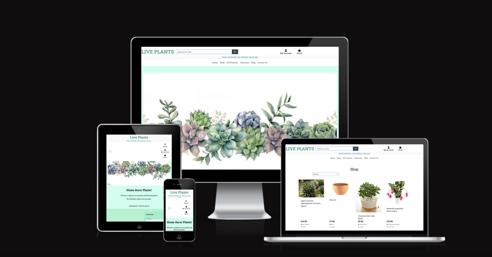
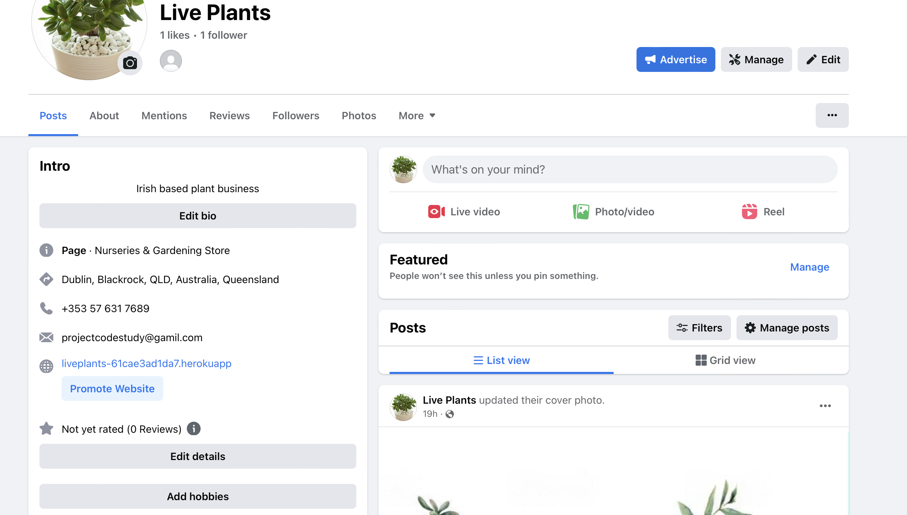
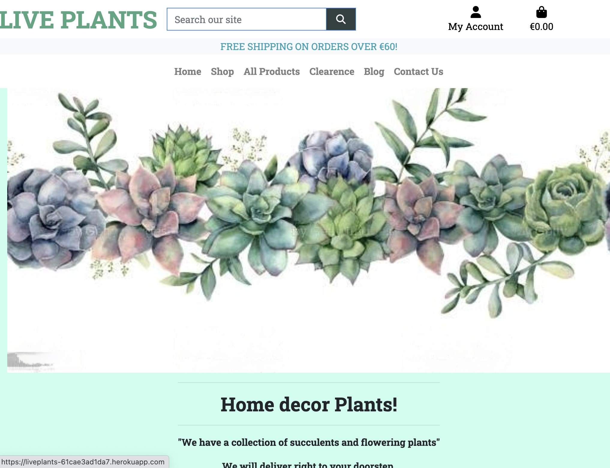
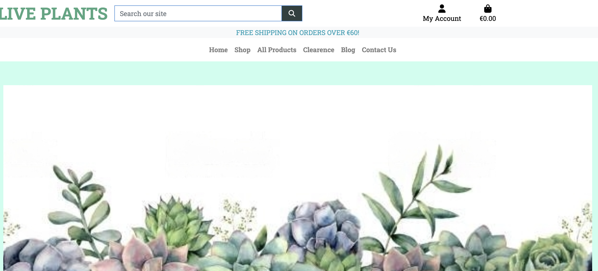
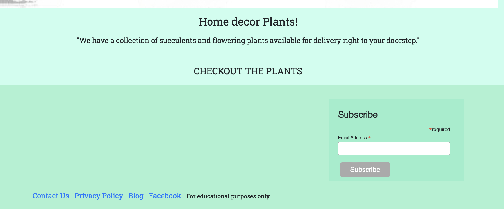
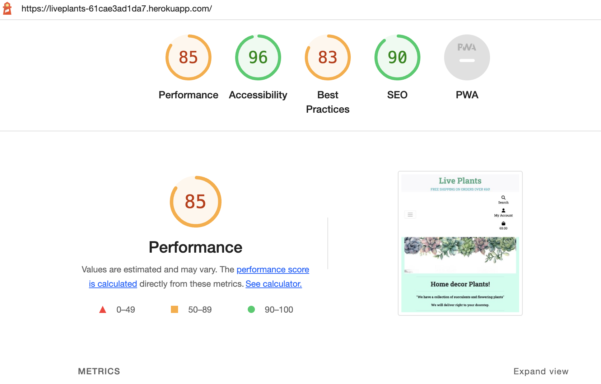

# Live Plants

## E-Commerce store for a selling house plants
------------------------------------



### Live site available [here](https://liveplants-61cae3ad1da7.herokuapp.com/). 


-----

## Table of Contents
--------------------------------------

- [Description](#description)
- [Design](#design)
- [UX](#ux)
- [Agile Development](#agile-development)
- [Web Marketing](#web-marketing)
- [Features](#features)
- [Testing](#testing)
- [Technologies](#technologies)
- [Deployment](#deployment)
- [Credits](#credits)
- [Acknowledgements](#acknowledgements)

------

## Description
---------------------------------------

Live Plant is a user-friendly online store where you can buy plants and manage the product inventory easily.
This fully functional E-Commerce store built in Django using Python, JavaScript, CSS, Bootstrap5, HTML and it incorporates stripe payments.
The site enables user roles, authentication, and Full CRUD for products, allowing interaction with a central dataset securely.

Live Plants site offers a wide selection of high-quality plants suitable for indoor and outdoor environments. With user-friendly navigation and secure payment options, customers can easily browse, select, and purchase their desired plants. We strive to provide excellent customer service and ensure a seamless shopping experience for all plant enthusiasts.

This website is designed as the final project for the Code Institute Diploma in Software Development course. Please note that it does not process real payments or fulfill orders. However, you are welcome to test the payment functionality using the provided card details when prompted.

`Card number: 5555 5555 5555 4444 or 4242 4242 4242 4242  Exp: any future date eg. 11/26 CVC: any 3 digits eg 123`


[Back to the Top](#table-of-contents)


-------
## Design
-------

---
###  Flow Chart and Database Schema

- Design Flow Chart [chart](./readme_images/pp5-flowchart.png)

- Data Base Diagram[Database Diagram](./readme_images/DB_diagram.png)


These colours were used:

 - #4fa680 , #397b65, #93eecaef
 

[Back to the Top](#table-of-contents)

---

## UX
*  The UX (User Experience) of Live Plants was designed to ensure a friendly and informative website. Users can easily explore and find products of interest, while the visually appealing design enhances the overall delightful and enjoyable online experience.

### The Sites Ideal User
* The ideal user for Live Plants is anyone who has an interest in plants, gardening, or adding greenery to their surroundings. Whether you're a beginner looking to start your plant collection or an experienced gardener seeking new additions, Live Plants caters to users of all levels. The site welcomes plant enthusiasts of various ages and backgrounds, providing a platform to explore and purchase a wide range of plants conveniently.


### Site Goals

* Site owner goals:
- Drive sales and generate revenue by offering a wide range of appealing and high-quality plants.
- Enhance customer satisfaction and loyalty through excellent customer service and a user-friendly website       
  experience.

* User goals:
- Easily find and explore a variety of plants based on their interests and preferences.
- Have a seamless and secure shopping experience, including convenient payment options and reliable product 
  information.

[Back to the Top](#table-of-contents)

## Agile Development


Agile methodology in GitHub was used to create this website.  User Stories were created using issues on git hub.
The link to the project board can be found [here](https://github.com/users/MinuMThomas/projects/15)

### Epics

1. Sign in/out 
2. Landing page/Frontend Templates 
3. View Products/Admin CRUD functionalikty 
4. Shopping Cart 
5. User Feedback 
6. Payments 
7. User Profile 
8. Contact site Owner/Social links 
9. Customer Reviews 

### User Stories

- User Sign in or Sign out
	*  User Account Login / Logout - As a User, I would like to be able to login or logout of my account, so that I can avail of the sites full functionality
	*  Receive Welcome Emails - As a user I would like to receive a welcome email upon signing up
    *  Reset password Functionality - As a user I would like to be able to reset my password to keep my account safe
    *  Visibly logged in or out - As a user I would like to know if I am logged in or not

- Landing page
	*  As a User I would like to be brought to the landing page upon first visiting the site so that I can see what options are available to me
    *  As a User from the landing page I should clearly be able to see and navigate the navbar
    *  As a User on the landing page I should be easily able to go straight to the shop and purchase an item

- View Products, Admin CRUD
    *  As a user I should be easily able to see a list of products available.
    *  As a user I should be able to click on any item to see more information about it.
    *  As an Admin I can add products to the database
    *  As an admin I can edit products in the database
    *  As an admin I can delete products from the database

- Shopping Cart
    *  As a user I can easily view the contents of my Cart
    *  As a user I can easily add/edit/delete the contents of my Cart
    *  As a user I can easily identify the total cost of my Cart

- User Feedback/Confirmation
    *  As a user I receive prompt feedback concerning my activity on the site
    *  As a user I can see a order confirmation message
    *  As a user I receive an order confirmation email

- Payment Feature
    *  As a user I can visit a payment screen
    *  As a user I can input my credit/debit card details

- User Profile
    *  As a user I can sign in/create a profile so that I can avail of the sites full functionality including leave customer reviews

- Contact site owner/Social links
    *  As a user I can signup to a Newsletter
    *  As a user I can fill out a contact form
    *  As a user I can clearly see contact information
    *  As a user I can easily find social media links and when pressed they take me to the correct site

- Customer Reviews
    *  As a user I can clearly see reviews left by past customers
    *  As a user who is logged in I can easily leave a review

[Back to the Top](#table-of-contents)

---


## Web Marketing

#### **E-Commerce Application Type**
The plant sell website follows a Business to Consumer (B2C) model, enabling direct transactions between the business and individual customers. It offers a wide selection of plants, allowing customers of all backgrounds and preferences to conveniently purchase their desired plants for personal use or gifting purposes.

#### **Marketing Strategy**
As Live Plants is a start-up business with limited marketing budget, there are several effective ways to boost sales and brand visibility. Utilizing Facebook to share engaging content and drive traffic is a primary and straightforward strategy. Paid advertisements can be employed to target specific demographics and enhance brand awareness. Leveraging social media platforms also facilitates customer feedback and improves customer service. Below is an image of the Facebook page, and you can access it [here](https://www.facebook.com/profile.php?id=100094558639714)
Another effective method is utilizing Google Ads, which can greatly enhance brand awareness and assist with SEO efforts. Google Ads can also aid in targeting specific long-tail keywords and improve the overall ranking of the website.

Another marketing strategy involves sending regular newsletters to the mailing list obtained through sign-up forms. These newsletters would include links to recent articles, new products, special offers, and promotions. This helps in building brand awareness and fostering a community around the brand.

#### **Search Engine Optimization**

To achieve high search engine rankings, the website implemented various SEO techniques. Additionally, essential files such as robots.txt and sitemap.xml were included to enhance search engine visibility and indexing of the site's content.


#### **Facebook Page**


---
#### Home page
A welcoming homepage was built to welcome the user to the site and clearly convey the sites purpose.



#### Navigation Bar
The main navigation bar appears at the top of the page, clearly displaying the main navigational links users would require including link to Contact and Blog. All produts link has dropdown menu with categories. 




#### Footer
A common footer is utilised throughout the site and including newsletter signup form from mailchimp.





#### Other Pages/Features
[Shop](./readme_images/shop.png)

[clearance](./readme_images/clearance.png)

[Cart](./readme_images/cart.png)

[Checkout](./readme_images/checkout.png)

[All Products](./readme_images/allprdt_dropdown.png)

[Subscribe](./readme_images/subscribe.png)

[Register](./readme_images/signup.png)

[Sign In](./readme_images/sign_in.png)

[Site Admin](./readme_images/site_admin.png)

[Individual Product Page](./readme_images/individual_pdt.png)

[Reviews](./readme_images/reviews.png)

[Blog](./readme_images/Blog.png)

[Blog deatail View](./readme_images/blog_detail.png)


## Future Enhancements
There are several items of functionality that I would like to add in the future. 
The key areas I would like to add to the site in the future are:

* Change the design 
* Add more categories in the shop

AllAuth signup:
The templates for allauth have been changed to suit the style of the site 


[Back to the Top](#table-of-contents)

---

## Testing

### Testing Strategy

For the development of the site, I employed a manual testing approach. In addition to functional and code testing, User Story tests were specifically implemented to verify that the criteria outlined in the user stories mentioned earlier were successfully fulfilled.


#### Testing Overview


## Testing 

Please refer to [TESTING.md](./TESTING.md) file for:
* Manual Testing and Results
* Validation of all languages


Testing was divided into different sections to ensure everything was tested individually with test cases developed for each area.


#### Validator Testing
All code files were validated using suitable validators for the specific language.
HTML & CSS code passed the validation.
JavaScript code produced one warning about an undefined variable but this is nothing to worry about as it is defined in another file, validation screenshots are included in [TESTING.md](./TESTING.md).


#### Lighthouse Testing
Below you can see the results of Googles Lighthouse Testing.




#### Python/JavaScript Testing
All Custom Python & JavaScript code was manually tested multiple times during and after development.
This is reflected in the fact that all of the user stories below are working and have produced no errors in the terminal or the console.


[Back to the Top](#table-of-contents)

-----

## Resources Used

* Python
* Django
    * Django was used as the main python framework in the development of this project.
* Heroku
    * Was used as the cloud based platform to deploy the site on.
* Heroku PostgreSQL
    * Heroku PostgreSQL was used as the database for this project during development and in production.
* JavaScript
    * Custom JavaScript was utilised to allow Users to close site messages and increment/decrement cart items.
* Bootstrap 4
    * Bootstrap was used for general layout and spacing requirements for the site.
* Font Awesome
    * Was used for access to several icons for different sections where icons were appropriate.
* CSS
    * Custom css was written for a large number of areas on the site to implement custom styling and escape a bootstrap look and feel to the site.
* Jinja/Django Templating
    * Jinja/Django templating language was utilised to insert data from the database into the sites pages. It was also utilised to perform queries on different datasets.
* HTML
    * HTML was used as the base language for the templates created for the site.
* Stripe
    * Stripe was used to allow the store to accept card payments.
* AWS
    * Amazone web servises used to store images and static files


## **Languages Used**
* [HTML5](https://en.wikipedia.org/wiki/HTML5) was used for the content and structure of the site.
* [CSS3](https://en.wikipedia.org/wiki/CSS#CSS_3) was used for the styling of the site.
* [JavaScript](https://en.wikipedia.org/wiki/JavaScript) was used for the interactivity of the site.
* [Python](https://www.python.org/) was used for the back end programming of the site.
## Frameworks Used
* [DJANGO - v3.2 ](https://docs.djangoproject.com/en/4.1/releases/3.2/) Django is a free and open-source, Python-based web  framework that follows the model–template–views architectural pattern.
* [Bootstrap4 - v4.6](https://getbootstrap.com/docs/4.6/getting-started/introduction/) was used as the frontend framework.
## Databases Used
* [DB.SQLITE3](https://docs.djangoproject.com/en/4.1/ref/databases/#sqlite-notes) was the database used for the project (development).
* [ElephantSQL](https://www.elephantsql.com/) ElephantSQL's Postgres as a Service was used to host the the database for the project (production).
## **Libraries and Packages Used**
* [django-allauth](https://django-allauth.readthedocs.io/en/latest/) is an integrated set of Django applications dealing with account authentication, registration, management, and third-party (social) account authentication.
* [JQuery - v3.5.1](https://jquery.com/) is a fast, small, and feature-rich JavaScript library.
* [Font Awesome Kit](https://fontawesome.com/v5/docs/web/setup/use-kit) is used for its icon toolkit.
* [django-countries, v7.2.1](https://pypi.org/project/django-countries/7.2.1/) was the Django application used to provide country choices for use with forms, and a country field for models.
* [django-crispy-forms, v1.14.0](https://pypi.org/project/django-crispy-forms/) was used to build programmatic reusable layouts out of form components.
* [gunicorn](https://gunicorn.org/) - a Python WSGI HTTP Server that allows us to run any Python application concurrently by running multiple processes within a single dyno
* [pillow](https://pypi.org/project/Pillow/) - a required Python imaging library used to enable handling of images.
* [psycopg2](https://pypi.org/project/psycopg2/) - a postgresql database adapter for python and used to connect with our postgres database
* [boto3==1.26.27](https://pypi.org/project/boto3/), [botocore==1.29.27] is an Amazon Web Services (AWS) software development kit (SDK) used to connect to the S3 bucket
* [pip](https://pip.pypa.io/en/stable/) is the package installer for Python, allowing us to install the packages we need for this site.
* [django storages](https://django-storages.readthedocs.io/en/latest/) - collection of custom storage backends for Django

## **Programmes and Applications Used**
* [Lucid Chart](https://www.lucidchart.com/pages/) was used to draw and build the Entity Relationship Diagram. It was also used to draw the User Flow Diagram.
* [favicon.io](https://favicon.io/) used to create the site's favicon
* [Git](https://git-scm.com/) used for version control and saving work in the repository, using the GitPod extension in Google Chrome to commit to GitHub.
* [GitHub](https://github.com/) is the project's git repository
* [GitHub Projects](https://docs.github.com/en/issues/planning-and-tracking-with-projects/learning-about-projects/about-projects) used to track and integrate issues for Agile Development
* [Chrome DevTools](https://www.google.com/intl/en_uk/chrome/) - used for debugging, validation (Lighthouse) and taking fullscreen screenshots of the site


## **Payment Processing Platform Used**
* [Stripe](https://stripe.com/gb) was used to test and implement the payment processing for the site.

Stripe how to test cards interactively:
| **CARD NUMBER** | **MM &amp; YY**  | **CVC** | **SIMULATED PAYMENT RESULT** |
| --- | --- | --- | --- |
| 4242 4242 4242 4242 | use any valid future month and year | use any three digit CVC | successful payment |
| 4000 0000 0000 0002 | use any valid future month and year | use any three digit CVC | generic decline |

## **Cloud Application Platforms Used**
* [Heroku](https://devcenter.heroku.com/) was used for hosting and deployment of the live site. Throughout, we have ensured the version being deployed to Heroku matches the development version by checking features and screen layouts on both versions.

## **Cloud Storage Services Used**
* [AWS S3](https://aws.amazon.com/) was used to store the images and static files.
---

<br/>


## CREDITS
### Code

The project very much got its start from Code Institutes walkthrough project Boutique Ado

PROJECTS I looked through for inspiration and problem solving:

- https://github.com/MinuMThomas/pp4-BB
- https://github.com/SamuelMasters/play-store, 
- https://github.com/rachel-o-donnell/black_and_white_beauty
- https://github.com/LauraMayock/Leather-works-sustainable-products
- https://github.com/KSheridan86/project-5-RossAnthonyDesigns
- https://github.com/Iris-Smok/JoyfulBookstore-PP5
- https://github.com/rachel-o-donnell/the-witchs-cauldron


README structure was adapted from the projects listed below, with some additions and amendments made by myself:

- https://github.com/MinuMThomas/pp4-BB, 
- https://github.com/KSheridan86/project-5-RossAnthonyDesigns, 
- https://github.com/rachel-o-donnell/black_and_white_beauty


* [ Favicon ](https://realfavicongenerator.net/)

## **Content**


The policy was generated from:
* [Privacy Policy Generator ](https://www.privacypolicygenerator.info/download.php?lang=en&token=2YTFAh7Aa8GDO5knKT5gJ2WAr7mS9EG2)

#### Packages Used


#### Resources Used

* The Django documentation was used extensively during development of this project
* The Cloudinary documentation was used.
* The Code Institute reference material was used as a general reference for things that I had previously done during the course.
* All other resources used are referenced where appropriate.


[Back to the Top](#table-of-contents)

----

## Deployment

The site was deployed via Heroku, and the live link can be found here - [Live Plants](https://liveplants-61cae3ad1da7.herokuapp.com/)

### Project Deployment

To deploy the project through Heroku I followed these steps:
* Sign up / Log in to [Heroku](https://www.heroku.com/)
* From the main Heroku Dashboard page select 'New' and then 'Create New App'
* Give the project a name 
* This will create the app within Heroku and bring you to the deploy tab. From the submenu at the top, navigate to the resources tab.
* Add the database to the app, 
* Create Database in ElephantSOL
- Follow the steps to Create PostgreSQL database instance
- Login/signup to ElephantSQL.com to access your dashboard
- Click “Create New Instance”
- Select the Tiny Turtle (Free) plan
- Select “Select Region” 
- Select a data center near you
- Then click “Review”
- Check your details are correct and then click “Create instance” 
- Return to the ElephantSQL dashboard and click on the database instance name for this project
- That’s the database created
- In the URL section, click the copy icon to copy the database URL
- Go back to the Heroku dashboard open the Settings tab add two config vars:
- DATABASE_URL, and for the value, copy in your database URL from ElephantSQL, no need to add quotation 
  marks.
- SECRET_KEY containing your secret key.
- Added the secret key to the Heroku Config Vars as "SECRET_KEY" for the KEY value and the secret key 
  value created as the VALUE.
- In the settings.py file within the Django app, imported Path from pathlib, os, and dj_database_url.
- Inserted the line if os.path.isfile("env.py"): import env to import the env.py file if it exists.
- Removed the insecure default secret key in the settings file and replaced it with SECRET_KEY = os.
  environ.get('SECRET_KEY').
- Replaced the databases section with DATABASES = {'default': dj_database_url.parse(os.environ.get
  ("DATABASE_URL"))}.
- Migrated the models to the new database connection in the termina

* Set up Amazon Web Services' S3 to host our static files and images
**Create an account**
- Create an AWS Account by going to [aws.amazon.com](https://aws.amazon.com/) and click on -create an aws account- by filling in your email and a password and choose a username for the account and select *continue*
- On the account type, select *personal*, fill out the required information, and click *create account and continue*
- Enter the credit card number which will be used for billing if the account goes above the free usage limits
- Complete the verification and once you confirm all the required information, your account will be created.
**Create a bucket**
- Once your signed in to your account, find S3 using the search bar, select and navigate to S3 to create a new bucket which will be used to store your static and media files
- Click the *create bucket* button and on the General configuration section, add the name of your bucket. It is a good idea to name the bucket the same as your project to keep your buckets organized and clear
- Select the region closest to you
- On the Object Ownership section, select *ACLs enabled* and a bucket ownership dropdown will appear, select *Bucket owner preferred*
- On the Block Public Access settings for this bucket section, uncheck *Block all public access*, check the *I acknowledge that the current settings might result in this bucket and the objects within becoming public* checkbox to make the bucket public and click *create bucket*
- Click the bucket you created and select the *properties* tab. Scroll down to find the *static web hosting* section and select *enable static web hosting*, tick *host a static website* and add *index.html* and *error.html* to the input fields for **Index document** and **Error document** respectively and click *save*.
- Open the permissions tab and copy the ARN (Amazon Resource Name). Navigate to the bucket policy section, click *edit* and select *policy generator*. From the *Select Type Policy* dropdown options, select S3 bucket policy. We want to allow all principal by adding the `*` to the input and the from the *Actions* dropdown, select *GetObject*.
- Paste the ARN we copied into the ARN (Amazon Resource Name) input field and click *add statement*, then click *generate policy*, copy the Policy from the new popup and paste it into the bucket policy editor and add `/*` at the end of the resource value to allow access to all resources in this policy and finally, click *save*.
- AWS has changed the format of their **cross-origin resource sharing (CORS)** configuration so we need to paste the update code below to the CORS section:
```json
[
  {
      "AllowedHeaders": [
          "Authorization"
      ],
      "AllowedMethods": [
          "GET"
      ],
      "AllowedOrigins": [
          "*"
      ],
      "ExposeHeaders": []
  }
]
```
- For the **Access control list (ACL)** section, click *edit* and tick *List* for **Everyone (public access)** and accept the warning box. If the edit button is disabled you need to change the **Object Ownership** section above to **ACLs enabled**.

**Create Group, Policies and Users using AWS's Identity and Access Management (IAM) service**<br/>
- Find IAM using the search bar, select and navigate to IAM to create a group, create an access policy to give the group access to the S3 bucket and assign the user to the group so it can use the policy to access the files.
 Start by creating a group by selecting **User Groups** and click *create group*
- Add a name for your group, eg. manage-black-and-white-beauty, then click *create policy* button
- Open the *JSON* tab on the new page and click the *import managed policy* link on the top right side of the page
- Search for S3 and select the pre-built *AmazonS3FullAccess* policy and click *import*
- Edit the policy by pasting the S3 ARN on *resource*, ie:
```json
{
    "Version": "2012-10-17",
    "Statement": [
        {
            "Effect": "Allow",
            "Action": "s3:*",
            "Resource": [
                "arn:aws:s3:::bucket-name",
                "arn:aws:s3:::bucket-name/*",
            ]
        }
    ]
}
```
- Click the *next* button and then *next: review*
- Give the policy a name, description then click the *create policy* button
- Next we need to attach to the Group the policy we just created. Go to *User Groups*, select the group and go to the permissions tab, click the *add permissions* button and select *attach policies* from the dropdown.
- Select the Policy you created and click *add permissions*
- We have to create a user for the group. Click *Users* from the left sidebar and then click the *add users* button and add a name for the user, eg. black-and-white-staticfiles-user
- Next tick *programmatic access* from Access Type and click *next: permissions*
- Add user to the group and click *next: tags*, *next: review* and then the *create user* button.
- The download the .csv file which will contain this user's access key and secret access key which we'll use to authenticate them from our Django app.

**10. Connecting Django to S3**
- Install two new packages: **boto3** and **django-storages**
```bash
pip3 install boto3
pip3 install django-storages
pip3 freeze > requirements.txt
```
- Add `storages` to the installed apps in **settings.py**
- Also on **settings.py**, add the bucket configuration:
```python
    if 'USE_AWS' in os.environ:
        AWS_S3_OBJECT_PARAMETERS = {
            'Expires': 'Thu, 31 Dec 2099 20:00:00 GMT',
            'CacheControl': 'max-age=9460800',
        }

        AWS_STORAGE_BUCKET_NAME = 'your bucket name goes here'
        AWS_S3_REGION_NAME = 'your selected region goes here'
        AWS_ACCESS_KEY_ID = os.environ.get('AWS_ACCESS_KEY_ID')
        AWS_SECRET_ACCESS_KEY = os.environ.get('AWS_SECRET_ACCESS_KEY')
        AWS_S3_CUSTOM_DOMAIN = f'{AWS_STORAGE_BUCKET_NAME}.s3.amazonaws.com'
```
- Open the .csv file we downloaded earlier and go to Heroku app dashboard and add these to Config Vars:
| Key | Value |
| :-- | :-- |
| AWS_ACCESS_KEY_ID | The access key value from the .csv file |
| AWS_SECRET_ACCESS_KEY | The secret access key value from the .csv file |
| USE_AWS | True |
- Remove **COLLECTSTATIC** variable from the Config Vars
- Create **custom_storages.py** file and add:
```python
from django.conf import settings
from storages.backends.s3boto3 import S3Boto3Storage


class StaticStorage(S3Boto3Storage):
    location = settings.STATICFILES_LOCATION


class MediaStorage(S3Boto3Storage):
    location = settings.MEDIAFILES_LOCATION
```
- Next, go back to **settings.py** file and tell it that for static file storage, we want to use our storage class we just created and that the location it should save static files us a folder called static. And then do the same thing for media files using the default file storage and media files location settings.
```python
    # Static and media files
    STATICFILES_STORAGE = 'custom_storages.StaticStorage'
    STATICFILES_LOCATION = 'static'
    DEFAULT_FILE_STORAGE = 'custom_storages.MediaStorage'
    MEDIAFILES_LOCATION = 'media'
```
- We also need to override and explicitly set the URLs for static and media files using our custom domain and the new locations:
```python
    # Override static and media URLs in production
    STATIC_URL = f'https://{AWS_S3_CUSTOM_DOMAIN}/{STATICFILES_LOCATION}/'
    MEDIA_URL = f'https://{AWS_S3_CUSTOM_DOMAIN}/{MEDIAFILES_LOCATION}/'
```
- Next, save the **settings.py** file, add all these changes, commit them and then issue a git push which will trigger an automatic deployment to Heroku. With that done if we look at the build log. We can see that all the static files were collected successfully
- To handle the media files, Let's go to s3 and create a new folder called media then click *upload*. Add the product images files, click *next* and under manage public permissions, select *grant public read access to these objects.* Then click *next* through to the end and finally, click *upload*.

11. Setting  up Stripe
- Log in to Stripe, click the *developers* link, and then *API Keys*
- Add them as Config Vars in Heroku
- Now we need to create a new webhook endpoint since the current one is sending webhooks to our gitpod workspace. We can do that by going to webhooks in the developer's menu and clicking *add endpoint*.
- Add the URL for our Heroku app, followed by /checkout/WH and select *receive all events and add endpoint*.
- We can now reveal our webhooks signing secret and add that to our Heroku config variables.


- In your code editor, create three new top level folders, media, static, templates
- Create a new file on the top level directory - Procfile
- Within the Procfile add the code - web: gunicorn PROJECT_NAME.wsgi
- In the terminal, add the changed files, commit and push to GitHub
- In Heroku, navigate to the deployment tab and deploy the branch manually - watch the build logs for any errors.
- Heroku will now build the app for you. Once it has completed the build process you will see a 'Your App Was Successfully Deployed' message and a link to the app to visit the live site.


#### Forking the repository

 - To make a copy of a GitHub repository without affecting the
   original one, you can fork it. 
 - Here are the steps:
 - Log into your GitHub account or create one if you don’t
   have one already.
 - Go to the original repository that you want to fork,On the 
   top right corner of the repository page, click the “Fork"
   button.
 - GitHub will create a copy of the repository in your own  
   account, which you can view or modify without affecting
   the original repository.


#### Create a clone of this repository

   - To create a local copy of a GitHub repository, you can
    use the clone command. This allows you to have the same
    files and code as the original repository at a specific
    point in time.
    Here are the steps to follow:
   - Go to the repository on GitHub.
    Click on the green "Code" button and select "Clone with
    HTTPS”.
   - Copy the URL that is displayed.
   - Open your code editor and navigate to the location where
   - you want to clone the repository.
   - In the terminal, type 'git clone' followed by the URL you
     copied from GitHub.
   - Press Enter and Git will clone the repository to your
    local machine.

[Back to the Top](#table-of-contents)

-----
#### Resources Used

* The Django documentation was used extensively during development of this project
* The AWS and STRIPE documentations were used.
* The Code Institute reference material was used as a general reference 
* The Django walk through project 'Boutique Ado'
* Myown project [PP4-BB](https://github.com/MinuMThomas/pp4-BB) 


## Credits

- All Images used across the site were sourced from
      [pexels](https://www.pexels.com)
- Social media links were all sourced from Font Awesome.
- Logo created from free logomaker site [site](https://myfreelogomaker.com/)

- I relied on the  Django walk through projects mostly.
    Further research was done by building walk through projects available freely on youtube and especially pyplane [youtube page](https://www.youtube.com/@Pyplane/videos) 

-----

## Acknowledgements

I would like to express my gratitude for the assistance and support provided by my colleagues especially Ivette and my mentor Daisy McGirr. 

I cannot underestimate the invaluable help I received from my wonderful kids, particularly my son Joe, and my daughters, Miriam and Mia. They have been incredibly understanding and supportive throughout the day, which made my work much easier. This achievement would not have been possible without their unwavering support

-----


[Back to the Top](#table-of-contents)