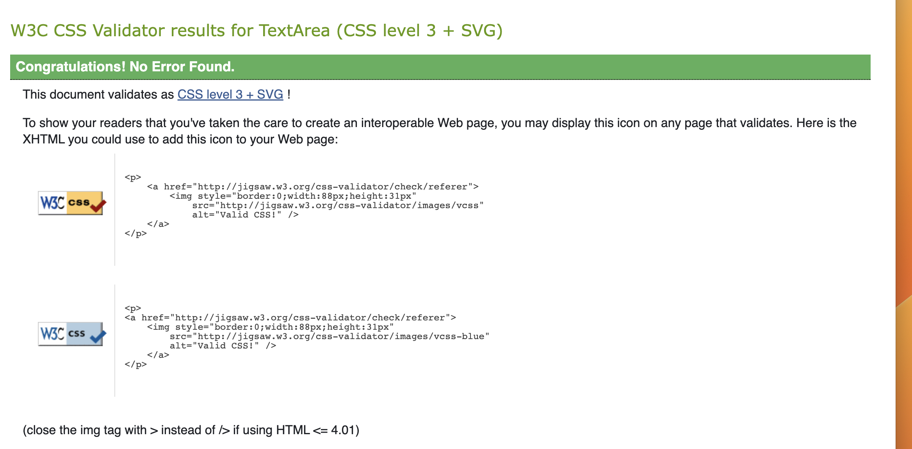

# **Live Plants**

 

**[Link to the Deployed Site](https://8000-minumthomas-pp5-a2cr1q16wq3.ws-eu101.gitpod.io/)**

---
## TABLE OF CONTENTS
* [Responsivness](#responsiveness)
* [Validation](#validation)
    * [HTML Validation](#html)
    * [CSS Validation](#css)
    * [JavaScript Validation](#javascript)
    * [Python Validation](#python)
    * [Lighthouse Report](#lighthouse)
    * [Testing](#manual-testing)
    * [Testing User Stories](#testing-user-stories)
    * [Full Testing](#full-testing)
    * [Bugs](#bugs)
  
    

&nbsp; 

# Responsiveness 
Dev tools were used to ensure responsiveness while in development but the site can be tested here -> [AM I Responsive ]() 
| Testing | Results |
|--------|---------|
| Navbar - goes to burger | PASS |
| footer | PASS |
| Home Page - fully responsive | PASS |
| Item Detail Page | PASS |
| Add Item | PASS |
| Edit Item | PASS |
| Delete Item | PASS |
| Categories  | PASS |
| Register | PASS |
| Loggout | PASS |
| Login | PASS |
| My Profile page | PASS |
| Order confirmation page | PASS |
| edit item | PASS |
| Home page | PASS |
| Login page | PASS |
| Loggout page | PASS |
| Register page | PASS |
| Password reset | PASS |
| Cart       | PASS |
| Items page | PASS |
| Items detail page | PASS |
| Store Management page | PASS |
| Edit Items page | PASS |
| Delete Items page | PASS |
| Blog page | PASS |
| Blog detail page | PAS |
| Contact Form     | PASS |
| see reviews page | PASS |
| no reviews page | PASS |
| add reviews page  | PASS |
| My Profile page | PASS |
| Past order detail | PASS |
| Add item to cart with checkout pop up with items in the toast | PASS | 
| Checkout | PASS |
| Order confirmation page | PASS |
| 500 | PASS | 
| 403 | PASS | 
| 404 | PASS | 

# Code Validation
&nbsp;

# HTML
Wc3 HTML: All pages pass without error * all pages tested but screenshots are no different so chose to only add one

| Testing | Results |
|--------|---------|
| Home page | PASS |
| Login page | PASS |
| Loggout page | PASS |
| Register page | PASS |
| Password reset |  PASS |
| CART.HTML WITH ITEMS | PASS |
| CART EMPTY HTML | PASS |
| Items page | PASS | 
| Items detail page | PASS |
| Store Management page | PASS |
| Edit Items page | PASS |
| Delete Items page | PASS |
| Blog page | PASS |
| Blog detail page | PASS |
| Contact form     | PASS |
| see reviews page (1 review )| PASS |
| no reviews page | PASS |
| My Profile page | PASS |
| Past order detail | PASS |
| Add item to cart with checkout pop up with items in the toast | PASS |
| Cart | PASS |
| Checkout | PASS |
| Order confirmation page | PASS |
| 500 | PASS | 
| 403 | PASS | 
| 404 | PASS | 

&nbsp;

# CSS 
Jigsaw Wc3 validation - passes without error * all pages tested but screenshots are no different so chose to only add one
&nbsp;

| Testing | Results |
|--------|---------|
| Base.css | PASS |
| Checkout.css | PASS | 
| Profiles.css | PASS |
 
&nbsp;

# JAvascript - JShint 

The only two errors came from JAvacript taken from Stripe and Mailchimp. I decided not to alter in case it broke the functionalities of either feature
[Jshint]()

| Testing | Results | |
|--------|---------|---------|
| CART.HTML | PASS | |
| Contact_form.html | PASS |  |
| Enquiries.html | PASS | |
| Add_item.html | PASS | 
| Edit_Item.html | PASS | 
| Items.html (1) | PASS | 
| Items- quantity-input.html | PASS |
| Blog.html | PASS |  
| countryfield/js profiles | PASS |
| add_review.html | PASS | 
| Base.html toasts | PASS |
| allauth email.html | PASS |
| Checkout/js/stripe_elements.js | Error coming from Stripe |[Stripe-js](./readme_images/stripe_js.png)|
| Base.html MAilchimp | Errors - see image |[mailchimp-js-errors](./readme_images/mailchimp_js.png) |

&nbsp;

# PYTHON
Pycodestyle used as linter in terminal

Pep8CI - all files pass without error and can be found here
[python validation images](./readme_images/python_test.png)

&nbsp;

&nbsp;

------
# Manual Testing

Manual tests were applied as I was building features to ensure all features added were as fully finished as needed at their respective stages. Any bugs found were either dealt with immediately or noted in READme for future fixing. Validators of affected/changed files /pages were rechecked after each bug fix after initial validation had begun

&nbsp;

### Hover Category Column expectations and steps : button changes color or adds an underline when hovered over and/or curser changes | ACtion taken hovered over |

#### NAVBAR 
| Testing | Expected Outcome | Steps | Hover | Results |
|--------|---------|---------|---------|---------|
| Logo | Logo link brings you to the home page | Clicked logo link when on different pages | PASS | PASS|
| Searchbar | Searching a title or description of an item will bring up the results of the search | Searched for various titles, keywords | PASS | PASS
| Home | Home button takes you to the home page | Clicked Home in Nabvar on various pages | PASS |  PASS |
| Items | Items dropdown features a list of categories | Clicked Categories button | PASS | PASS |
| Categories | Clicking the categories links will bring you to a page with all items relating to that category | Clicked all categories, each time the page rendered Items that had been tagged with that category | PASS | PASS |
| Blog | Clicking the Blog links will bring you to a page with all blogs content| CLicked link and the page rendered the blog | PASS | PASS |
| Log In | Sign In takes you to a sign in page |  Clicked Sign In | PASS | PASS |
| Register | Register takes you to a register page |  Clicked Register in Nabvar | PASS | PASS |
| Register Confirm email | Registering send a real email with a link to confirm your email | Registered as a new user using 10minutemail.com | PASS | PASS | 
| Logout | Logout takes you to a logout page |  Clicked Logged Out in Nabvar | PASS | PASS |
| My Profile | Brings user to their profile page| Clicked my profile | PASS | PASS |
|ADMIN EXRAS |
| Store Management | clicking this brings you to add an item page | Clicked link| PASS | PASS |
| Cart icon | clicking this brings you to the cart page | Clicked link | PASS | PASS |
| Cart amount| Adding items to your cart displays value on the navbar | added items to cart | PASS | PASS |
| TOAST MESSAGES |
| Sign In | Sign In message appears in banner |  Signed In | PASS | PASS |
| Register | Register message appears in banner |  Registered as new User | PASS | PASS |
| Logout | Logout message appears in banner |  Logged out | PASS | PASS |

&nbsp;

#### HOME PAGE 
| Testing | Expected Outcome | Steps | Hover | Results | 
|--------|---------|---------|---------| --------- |
| Shop the gallery | clicking this button takes you to all the items in the store | Clicked button | PASS | PASS |

&nbsp;

#### ITEMS PAGE 
| Testing | Expected Outcome | Steps | Hover | Results |
|--------|---------|---------|---------|---------|
| header displays the correct label | header displays a corresponding title depending on search  - | choose different categories | - | PASS | 
| cards display correct info | cards display correct info | added item | PASS | PASS | 
| Clicking on image field | brings you to item detail page | clicked image | PASS | PASS |
| category field | clicking link renders that category page | clicked link | PASS | PASS |
| sort by | clicking renders drop down | clicked | PASS | PASS |
| sort by choices | clicking choices orders the view from low to high price or vice versa | clicked | PASS | PASS |
| Back to top | Clicking brings you to the top of the page | Clicked | PASS | PASS |
| ADMIN EXTRAS |
| ACCESS| Can only be accessed by Admin | - | - | PASS | 
| Edit | clicking brings you to Edit Items page | clicked |  PASS | PASS |
| Delete | clicking renders a confirmation/delete pop up | clicked  | PASS | PASS |

&nbsp;

#### ITEMS DETAIL PAGE
| Testing | Expected Outcome | Steps | Hover | Results |
|--------|---------|---------|---------|---------|
| reviews button | clicking renders reviews page | clicked | PASS | PASS |
| Item in stock | Item in stock, add to bag and qty button displays,  |  | - | PASS |
| Item out of stock | Item out of stock, add to bag and qty button disappear - contact button displayed |  updated item to out of stock | PASS | PASS |
| add reviews button | Pressing add review renders the review form | pressed the add review button | PASS | PASS |
| Quantity button | add and minus buttons work | pressed plus and minus buttons | PASS | PASS |
| Quantity button disabled | minus button disables when item is at 1 , plus disable when items are at 98 | pressed plus and minus buttons | PASS | PASS |
|Quantity input negative numbers | cannot add negative numbers - user is prompted to correct their input | Entered -1 into input box | PASS | PASS |
|Quantity input over 99 items | cannot add more than 99 items to cart - user is prompted to correct their input | Entered 100 into input box | PASS | PASS |
| Quantity input over 99 items | cannot add more than 99 items to cart by adding in separate transactions - user is prompted by toast to correct their input | Entered 100 into input box | - | PASS | - Send the message but still adds the items
| Continue shopping | clicking brings to all items page | clicked button | PASS | PASS |
| Add to cart | Adds item with quantity to cart | added various quantities of items to cart | PASS | PASS |
| Contact Us | Clicking link opens the contact form page | clicked link |  PASS | PASS |
| ADMIN EXTRAS |
| ACCESS| Can only be accessed by Admin | typed items/edit to end of url as normal user | - | PASS |
| Edit Items button | Clicking renders Edit Items page |  clicked button | PASS | PASS |
| Delete Items | Clicking renders Delete Items Pop up | clicked button | PASS | PASS |
| ITEMS TOAST MESSAGES |
| Edit item | Your Item was edited message appears | Edited an item | PASS | PASS |
| Delete item| Your Item was deleted message appears | Deleted an item | PASS | PASS |

&nbsp;

#### CART POP UP 
| Testing | Expected Outcome | Steps | Hover | Results |
|--------|---------|---------|---------|---------|
| cart summary | displays summary of cart items | added items to cart | - |PASS |
| Free delivery prompt | If free delivery threshold isn't met message is displayed with how much more to spend to get free delivery | Added items below threshold value| - | PASS|
| Free delivery prompt not displaying | When threshold is met free delivery message is displayed | Added items over threshold | - | PASS | 
| checkout button | Go to secure checkout page | clicked | - | PASS | 

&nbsp;

#### BLOG PAGE 
| Testing | Expected Outcome | Steps | Hover | Results |
|--------|---------|---------|---------|---------|
| header displays the correct label | - | - | - | PASS | 
| cards display correct info | - | - | - | PASS | 
| image field | Clicking on image field brings you to Blog detail page | clicked | - | PASS | 
| Back to top | Clicking brings you to the top of the page | Clicked | PASS | PASS |

&nbsp;

#### BLOG DETAIL PAGE
| Testing | Expected Outcome | Steps | Hover | Results |
|--------|---------|---------|---------|---------|
| Displays Blog info | - | - | - | PASS | 
| Continue shopping | Clicking brings you back to all items page | Clicked | PASS | PASS 
| Back to Blog| Clicking link opens the Blog list page | clicked link |  PASS | PASS |

&nbsp;

#### PROFILE
| Testing | Expected Outcome | Steps | Hover | Results |
|--------|---------|---------|---------|---------|
| Default Delivery info (Blank) (see more in  CHECKOUT FORM : PERSONAL DETAILS -> PROFILE PAGE ) | 
| Update Info button | Editing the form and Clicking this saves the new information to the page | Created new user, entered info, clicked button | PASS | PASS |
| Order History | Order History Displayed | Bought somethings as a user |  PASS | PASS |
|Order Confirmation | Order Confirmation can be accessed by clicking the order number link | clicked | PASS | PASS |
| ITEMS TOAST MESSAGES |
| Update Info | Update info message appears | Updated info | - | PASS |

&nbsp;

#### ORDER CONFIRMATION PAGE 
| Testing | Expected Outcome | Steps | Results | Hover |
|--------|---------|---------|---------|---------|
| Full order summary is displayed | - | - | - | PASS |
| Back to profile button | - | - | PASS | PASS | 

&nbsp;

#### CART
| Testing | Expected Outcome | Steps | Hover | Results |
|--------|---------|---------|---------|---------|
| Cart Empty |
| Continue shopping | clicking brings to all items page | clicked button | PASS | PASS |
|Caet with items |
| Items displayed | - | - | - | PASS | 
| Quantity button | add and minus buttons work | pressed plus and minus buttons | PASS | PASS |
| Quantity button disabled | minus button disables when item is at 1 , plus disable when items are at 98 | pressed plus and minus buttons | PASS | PASS |
|Quantity input negative numbers | cannot add negative numbers - user is prompted by toast to correct their input  by toast message | Entered -1 into input box | PASS | PASS |
|Quantity input over 99 items | cannot add more than 99 items to cart - user is prompted by toast to correct their input | Entered 100 into input box | - | PASS |
| User cannot have over 99 items in cart  | cannot add more than 99 items to cart - user is prompted to correct their input | Entered 50 items in one action then tried to add 50 of the same item in another action | PASS | PASS |
|Update button | Changing number in input and pressing this updates quantity and toast message appears  | Adjusted amount and pressed update | PASS | PASS |
| Subtotal calculated | - | - | - | PASS | 
| Continue shopping | clicking brings to all items page | clicked button | PASS | PASS |
| DELIVERY CHARGES |
| Delivery threshold met | Delivery charge is 0, free delivery message in blue | Added amount over 60euro | - | PASS | 
| Delivery threshold unmet | Delivery charge is added, Free delivery prompt message in red | Added amount under 60euro | - | PASS | 
| Continue shopping | clicking brings to all items page | clicked button | PASS | PASS |
| Back to top | Clicking brings you to the top of the page | Clicked | PASS | PASS |
| Secure checkout |  Clicking brings you to checkout page | Clicked | PASS | PASS |

&nbsp;

#### TOAST MESSAGES CART AND ADDING TO CART
| Testing | Expected Outcome | Steps | Results |
|--------|---------|---------|---------|
| Add Item to cart | Item added to cart appears with a summary of how many and a cart summary | Added multiple Items to cart | - | PASS |
| Update quantity Item - item page | Your Comment was edited message appears | Updated cart amount from item detail page  | - | PASS |
| Update quantity Item in cart - cart page | Your cart was edited message appears | Updated cart amount from cart page | - | PASS |
| Quantity input negative numbers | cannot add negative numbers | Added negative number in  | PASS | PASS |
| Delete an Item in cart - item page | Your Comment was deleted message appears | Deleted an item | PASS | PASS |
| Delete an Item in cart - cart page| Your Item was deleted message appears | Deleted an item | PASS | PASS |

&nbsp;

#### CHECKOUT FORM : PERSONAL DETAILS
| Testing | Expected Outcome | Steps | Hover | Results |
|--------|---------|---------|---------|---------|
| NEW USER | 
| Users email and info are automatically input in they have filled out their profile delivery info blank otherwise | Created new user filled out details in profile and form is filled |
| Relevant field and labels are displayed | - | - | - |  PASS |
| Form Validation EMPTY | Form validation will prompt for user action if empty form is submitted |   Try to submit empty form | - | PASS |
| Form Validation Only Required Fields | Form validation will prompt for user action to fill content if only title is filled |  Try to submit only title | - | PASS |
| Form Validation ALL DETAILS | complete purchase and submit bring you to order Confirmation page with details of order | Fill all details of form and submit  | PASS | PASS |
| save delivery info | delivery info displayed in Profile Page | completed order| PASS | PASS |
| Confirmation EMAIL | complete purchase and submit Order Confirmation email with details of order | Fill all details of form and submit | - |  PASS |
| Order goes to order history | Order goes to order history | Completed order went to profile | - |  PASS |
| Stripe payment | Stripe payment working | Completed order went to Stripe Developer Webhooks | - |  PASS |
| ITEMS TOAST MESSAGES |
| Success message | Confirmation message appears with order number | Completed a purchase | - | PASS |

&nbsp;

#### FORMS 

#### REVIEWS 
#### ADD A REVIEW FORM
| Testing | Expected Outcome | Steps | Hover | Results |
|--------|---------|---------|---------|---------|
| Relevant field and labels are displayed | - | - | - | PASS |
| Form Validation EMPTY | Form validation will prompt for user action if empty form is submitted |   Try to submit empty form | - | PASS |
| Form Validation Only Required Fields | clicking submits review, review renders in correct area |  submit only required fields  | - | PASS |
| Dropdown menus | dropdown features a list of items                     | Clicked button | PASS | PASS |
| Select Image has prompt| - | - | - | PASS |
| Select Image Adds filename | - | - | - |  PASS |
| Featured Button has prompt  | - | - | - |  PASS |
| Featured tick box | ticking this publishes review to site  otherwise renders in django admin | ticked | PASS | PASS | 
| Submit button | clicking bring submits review, review renders in correct area | clicked | PASS | PASS |
| Cancel Button | clicking bring back to home page | clicked | PASS | PASS |

&nbsp;

### REVIEW FORM VIEW: REVIEWS
| Testing | Expected Outcome | Steps | Results | Hover |
|--------|---------|---------|---------|---------|
| Review form submissions are rendered for correct item | - | - | - |  PASS | 
| header displays the correct label | Reviews header should match the item | clicked on reviews | PASS | PASS | 
| appear by Oldest to newest | - | - | - |  PASS |
| All fields are displayed | - | added a review | - | PASS | 
| Continue shopping | clicking brings to all items page | clicked button | PASS | PASS |
| REVIEWS TOAST MESSAGES |
| ADD review| review added message appears | Added review | PASS | PASS |
| Delete review | Your review was deleted message appears | Deleted a review | PASS | PASS  | 

&nbsp;

#### CONTACT FORM
| Testing | Expected Outcome | Steps | Hover | Results |
|--------|---------|---------|---------|--------|
| Relevant field and labels are displayed | - | - | - | PASS |
| Form Validation EMPTY | Form validation will prompt for user action if empty form is submitted |  Try to submit empty form | - | PASS |
| Form Validation Only Required Fields | Form submits and rendered in enquiries  |  Try to submit required field| - | PASS |
| ITEMS TOAST MESSAGES | message displays when submitted | submitted form | - | PASS | 

&nbsp;

#### ADD ITEM FORM 
| Testing | Expected Outcome | Steps | Hover | Results |
|--------|---------|---------|---------|---------
| ACCESS | Can only be accessed by Admin | - | - | PASS |
| Relevant field and labels are displayed | - | - | - | PASS |
| Category Dropdown | clicking displays a list of options | clicked | PASS | PASS |
| Form Validation EMPTY | Form validation will prompt for user action if empty form is submitted |   Try to submit empty form | - |PASS |
| Form Validation Only Required Fields | Dsiplays item in store and in the correct category fields |  Submitted from filled correctly  | - | PASS |
| Form Validation ALL DETAILS | Fill all details of form | User returned to homepage and post is displayed with all relevant info on all items page and all extra details on the items detail page, post appears in relevant category search | - | PASS |
| ADD item button | Adds item to the store | clicked | PASS| PASS |
| Cancel Button | brings user to all Items page | clicked | PASS| PASS |
| ITEMS TOAST MESSAGES |
| ADD Item | Item added message appears | Added an item |  PASS | PASS |

&nbsp;

### ADD ITEM VIEW: ITEMS/ CATEGORIES
| Testing | Expected Outcome | Steps | Hover | Results |
|--------|---------|---------|---------|---------|
| Contact form submissions display in All Items and Relevant Categories |
| All fields are displayed | - | - | - | PASS |

&nbsp;

#### EDIT ITEM FORM 
| Testing | Expected Outcome | Steps | Hover | Results |
|--------|---------|---------|---------|---------
| ACCESS | Can only be accessed by Admin | - | - | PASS |
| Image renders | Image of item renders | - | - | PASS |

#### ERROR PAGES 
| Testing | Expected Outcome | Steps | Results |
|--------|---------|---------|---------|
| 404 |  404 Error page appears when page request does not exist | entered /help at the end of the http | PASS |
| Continue shopping | clicking brings to all items page | clicked button | PASS | PASS |
| 500 | 500 Error page appears when there is a server error | Unable to test server error | - | - |
| Continue shopping | clicking brings to all items page | clicked button | PASS | - |
| 403 | 403 Error page appears when user tries to access a page they are not allowed | address when signed in as as regular user  | - | PASS |
| Continue shopping | clicking brings to all items page | clicked button | PASS | PASS |

&nbsp;

#### FOOTER
| Testing | Expected Outcome | Steps | Hover | Results |
|--------|---------|---------|---------|---------|
| Facebook link | Clicking facebook link opens the respective page in a new tab, | Clicked each icon | PASS | PASS | PASS |
| Contact Us | Clicking link opens the contact form page | clicked link |  PASS | PASS |
| privacy policy | Clicking link opens the privacy policy external page link | clicked link | PASS | PASS |
| Mailchimp | Subscribing should add you to mailchimp email | added email and clicked subscribe , checked if the mailchimp user number increased | PASS | PASS |
| Footer Logo | Footer Logo link brings you to the home page | Clicked footer logo | PASS | PASS |

&nbsp;

# BUGS

No  bugs 

Return to [README.md]() 